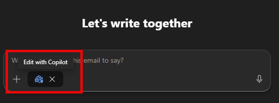

[Back to Index](https://microsoftlearning.github.io/MS-4021-Copilot-Immersion-Experience/)

# Legal Demo

**Scenario:**

You're a legal advisor at Contoso assessing whether the company's new AI Resume Screening Software complies with the EU AI Act. You'll use Copilot to research the regulation and its specific obligations for hiring tools, draft a leadership-ready executive summary of the legal risks and recommendations, and email those findings to executive leadership with a request for next steps.

## Demo Setup

There are no sample documents required for this demo.

## Demos

### Copilot Chat

Let's start by researching the EU Artificial Intelligence Act and its potential impact on Contoso's AI hiring tool.

1. Open a browser and navigate to [M365copilot.com](https://m365copilot.com/).

1. Ensure **Web mode** is selected.

    

1. In the prompt window, type the following:

    ```text
      Contoso is launching an AI Resume Screening Software to evaluate job applicants. As a legal advisor, I need to assess whether it complies with the EU Artificial Intelligence Act. Summarize key provisions related to AI in hiring, compliance requirements for high-risk systems, and potential legal risks.
    ```

1. Review Copilot's response and take notes on relevant legal risks and compliance requirements.

1. Now we will ask Copilot a series of follow up questions to gather more information:

    ```text
    Does the AI Act classify resume screening software as a high-risk AI system?
    ```

    ```text
    What are the key obligations for high-risk AI systems under the AI Act?
    ```

    ```text
    Are there any exemptions in the AI Act that could apply to Contoso's system?
    ```

1. Now ask Copilot to summarize all the information so far:

    ```text
    Summarize all the information we've discussed into a structured list, ensuring no key details are missed. Then, export the summary to a Word document
    ```

1. Select the hyperlink Copilot provides for the new Word document to open it.

1. Once opened, select **Enable Editing** and then turn on "AutoSave". Select your OneDrive account when prompted.

1. Copy the shared URL for use in the next step. (Enable AutoSave and select your OneDrive account if prompted.)

    

### Copilot in Word

Now, we'll draft an executive summary outlining legal risks and recommendations for Contoso's leadership.

1. Open a new instance of Word, either in your browser or desktop application.

1. In the **Describe what you'd like to draft with Copilot?** prompt box, type the following:

    ```text
    Reference the following document [Link to exported Copilot Chat summary from the first task] and draft an executive summary outlining key legal risks, compliance requirements, and recommendations for Contoso's AI Resume Screening Software.
    ```

    > **NOTE:** Attach the document or paste the shared link directly into the prompt to ensure Copilot can access the relevant content.

1. Review Copilot's output. Before selecting **Keep it**, refine the response by asking Copilot:

    ```text
    Add a section on the potential business impact of these compliance requirements.
    ```

1. Other optional refinements:

    - Ask Copilot to reword sections for a more professional tone.
    - Request a shorter, more concise version if the summary is too long.
    - Expand with additional sections.

1. After reviewing and finalizing the document, rename the document to **Legal Assessment.docx** and copy the shared URL for use in the next step. (Enable AutoSave and select your OneDrive account if prompted.)

### Copilot in Outlook

Lastly, we'll draft an email to Contoso's leadership summarizing our findings and next steps.

1. Open Outlook (either in your browser or desktop application).

1. Select **New Email**.

1. Select the **Copilot** icon to the right of the ribbon.

1. Ensure **Edit with Copilot** is enabled.

    

1. Enter the following prompt:

   ```text
    Draft an email to Contoso's executive leadership summarizing our legal assessment of the AI Resume Screening Software under the EU AI Act. Use [Legal Assessment.docx] as a reference.

    Conclude the email with a request for leadership's input on the next steps, including a proposed compliance review meeting.
   ```

    > **NOTE:** Select **Add and manage sources** > **Add work content** and search for **Legal Assessment.docx**. If the file is not available, you can select **Upload images and files** to upload the file directly.

1. Once the draft is generated, feel free to adjust the tone, length, or level of formality.

## Key Takeaway

In one workflow, you turned a fast-moving regulatory question into a leadership-ready decision packet — using **Copilot Chat** to research the EU AI Act and pressure-test how it applies to Contoso's hiring tool, **Copilot in Word** to draft a polished executive summary of the risks and recommendations, and **Copilot in Outlook** to brief leadership and request next steps. Days of legal research, drafting, and stakeholder communication collapse into a single focused session.

[Back to Index](https://microsoftlearning.github.io/MS-4021-Copilot-Immersion-Experience/)
