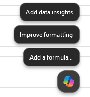
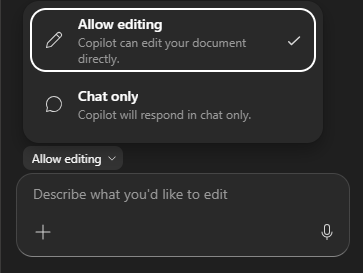
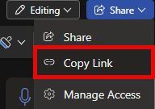

[Back to Index](https://microsoftlearning.github.io/MS-4021-Copilot-Immersion-Experience/)

# Finance Demo

**Scenario:**

You're a financial analyst at Contoso evaluating sales performance and market positioning in the EV charging industry. You'll use Copilot to interrogate your sales data and surface the products, customers, and industries driving the business, benchmark those numbers against the wider market and key competitors, and then summarize the takeaways in a polished email to your team.

## Demo Setup

The sample documents can be found in the MS-4021 GitHub repository [here](https://github.com/MicrosoftLearning/MS-4021-Copilot-Immersion-Experience/tree/master/ResourceFiles):

The specific files needed for this demo are:

- [EV_Charger_Sales_Analysis_v1.xlsx](https://github.com/MicrosoftLearning/MS-4021-Copilot-Immersion-Experience/raw/master/ResourceFiles/EV_Charger_Sales_Analysis_v1.xlsx)

> **NOTE:** Allow up to 10 minutes for these files to sync to your OneDrive after downloading. To avoid delays during the demo, ensure these files are downloaded and available in your OneDrive well in advance. If the files are not available, open the documents and copy the shared file links to use in the demo.

## Demos

### Copilot in Excel

Use Copilot in Excel to analyze sales data, identify key trends, and calculate financial metrics.

1. Launch Excel and open **EV_Charger_Sales_Analysis_v1.xlsx** (either in your browser or desktop application).

1. Navigate to the **Sales by Product** tab.

1. Select the **Copilot icon** in the bottom right hand corner of the document.

    

1. Ensure **Allow editing** is selected.

    

1. Use Copilot to sort the table by entering the following prompt:

    ```text
    Sort the table by date in descending order, from the most recent to the oldest entry.
    ```

    - Copilot sorts the table and updates the dataset.
    - Select **Apply** after sorting.

1. Use Copilot to insert a total revenue column. Enter the following prompt in the Copilot pane:

    ```text
    Add a new column named 'Total Revenue'. Populate it by multiplying 'Units Sold' by 'Product Price' for each row.
    ```

    - Copilot creates the new column and applies the formula.
    - Select **Insert Column**.

1. Use Copilot to generate a sales summary table for 2024. Enter the following prompt in the Copilot pane:

    ```text
    Create a summary table for total sales in 2024. The table should include Product ID, total units sold, and total revenue.
    ```

    - Copilot generates a summary table.
    - Select **Add to a new Data Sheet** to store the table separately.
    - Ensure the table includes **only 2024 data**.
    - Navigate back to the **Sales by Product** tab or select **Go back to data** under Copilot's last response.

1. Use Copilot to identify the best-selling product. Enter the following prompt in the Copilot pane:

    ```text
    Identify the product ID with the highest total revenue in 2024. Provide both total revenue and total units sold for better comparison.
    ```

    - Copilot analyzes the dataset and provides the top-selling product.
    - Navigate back to the **Sales by Product** tab or select **Go back to data** under Copilot's last response.

1. Use Copilot to sort customers by revenue.

    - Navigate to the **Customers** sheet in Excel.

    Enter the following prompt in the Copilot pane:

    ```text
    Sort the 'Customers' tab by annual revenue in descending order.
    ```

    - Copilot sorts the customers by **annual revenue**.
    - Select **Apply** after sorting.

1. Use Copilot to calculate average revenue per customer. Enter the following prompt:

    ```text
    Calculate the average revenue per customer.
    ```

    - Copilot calculates the average and adds the result.
    - Select **Insert Row** to store the average revenue value.

1. Use Copilot to find the industry using the most power. Enter the following prompt in the Copilot pane:

    ```text
    Analyze the data to determine which industry has the highest total power consumption. Provide the industry name and total power usage.
    ```

    - Copilot processes the data and returns the industry with the highest power consumption.

1. Save the document. Copy the shared URL from the document (enable AutoSave and select your OneDrive account if prompted).

    

### Copilot Chat

Use Copilot Chat to compare financial performance with industry benchmarks and competitors.

1. Open a browser and navigate to [M365copilot.com](https://m365copilot.com/).

1. Ensure **Web mode** is selected.

    

1. In the prompt window, type the following:

    ```text
    Our total revenue for [EV chargers] exceeded $50,000,000 for first half of 2024. Compare this to the industry average and provide insights on whether we are above or below industry standards. If possible, include market share estimates and trends.
    ```

1. Now ask Copilot Chat to compare this to competitors:

    ```text
    Summarize the key financial statements of two major competitors in the [EV charging] industry. Include revenue, net profit, and any other relevant financial insights. If available, provide comparisons to our financial performance.
    ```

1. Once you're happy with the draft, export the response directly to Word. At the bottom of Copilot's response, select the **More options (…)** menu and choose **Export to Word**.

    

    > **NOTE:** Copilot saves the response as a Word document in your OneDrive. Select **Open Word** to open the Word document in a new browser tab.

1. Select **Enable Editing**.

1. The file should have title similar to **Charging_industry_Financial_Summary.docx**. Copy the shared URL from the document (enable AutoSave and select your OneDrive account if prompted).

    

### Copilot in Word

Use Copilot in Word to summarize financial insights into an email for our team.

1. Open a new Word document (either in your browser or desktop application).

1. In the **Describe what you'd like to draft with Copilot?** prompt box, type the following:

    ```text
    Draft an email to my team summarizing the key insights from [Charging_industry_Financial_Summary.docx].
    ```

    > **NOTE:** Attach the Charging_industry_Financial_Summary.docx file created in the previous task or paste the shared link directly into the prompt to ensure Copilot has access to the relevant content.

1. Review Copilot's output. Before selecting **Keep it**, refine the response by asking Copilot:

    ```text
    Shorten this email draft
    ```

1. Other optional refinements:

    - Ask Copilot to reword sections for a more professional tone.
    - Expand with additional sections.
    - Make it less formal.

1. Once finished, you can select **Keep it**.

## Key Takeaway

In a single workflow, you turned raw sales data into a board-ready brief — using **Edit with Copilot in Excel** to surface top products, top customers, and the highest-consumption industries; **Copilot Chat** to benchmark those numbers against industry trends and competitor financials; and **Copilot in Word** to summarize the takeaways in a polished email to your team. Hours of pivot-table wrangling, research, and writing collapse into a focused, end-to-end analysis.

[Back to Index](https://microsoftlearning.github.io/MS-4021-Copilot-Immersion-Experience/)
