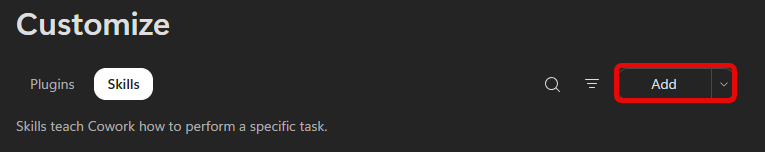

# Cowork Skill Builder Demo

**Scenario:**

You regularly ask Copilot to draft messages, but the results do not consistently sound like you. You'll use the guided skill builder in Copilot Cowork to create a reusable **Sound Like Me** skill. The skill uses Work IQ to reference your own recent Microsoft 365 messages and applies the writing rules you provide.

This demo is designed to take approximately 5-8 minutes.

## Demo Setup

There are no sample documents required for this demo.

Before the session, identify a short message you can ask Cowork to draft when testing the skill, such as a project update or a note to your manager.

> **NOTE:** The prompts in this demo are suggestions. You can adjust the writing rules to reflect your own voice and the type of messages you write.

> **PRESENTER NOTE:** Cowork tasks are available under **My tasks**. If time is limited, build and save the skill before the session. During the demo, start the skill-building conversation live, then switch to the completed conversation or saved skill to show the result.

## Demo

### Build a Skill in Copilot Cowork

1. Open [Microsoft Copilot](https://m365.cloud.microsoft/chat/) and select **Cowork**.

1. In the navigation pane, select **Customize**, open the **Skills** tab, and select **Add**.

    

    > **TIP:** You can also start from a new Cowork task and tell Cowork what you want by beginning with, "I'd like to build a skill that..."

1. The guided skill builder asks what the skill should do and follows up on details such as tone, structure, and what the skill should always or never do.

    

1. Use the following brief to begin the conversation:

    **Sample Prompt:**

    ```text
    I'd like to build a skill that makes my drafts sound like me. When I ask for something "in my voice," "written like me," or "ready to send," pull 10-15 of my own recent messages of the same type from my Microsoft 365 activity, including sent emails and Teams messages, and match their cadence, length, structure, and tone instead of using a generic assistant style.

    The skill should:
    - Lead with the ask, decision, or main point, then add context only as needed.
    - Keep it short and direct. Remove corporate filler, over-explaining, and unnecessary hedging.
    - Use bullets when there are multiple asks, options, or concerns.
    - Avoid generic assistant phrasing such as "I hope this message finds you well" or "I wanted to reach out."
    - Never fabricate facts, names, numbers, dates, or commitments. If a draft needs information only I would know, ask me or flag the gap.
    ```

1. Submit the prompt.

1. Answer the guided builder's follow-up questions in plain language. Use the builder to refine the skill's name, description, and instructions until they reflect the requested writing rules.

    > **NOTE:** The guided builder may ask different follow-up questions depending on the information already provided.

1. Save the skill when the builder presents the completed version.

1. Confirm that the new skill appears under **Customize** > **Skills**.

### Test the Skill

1. Start a **New task** in Cowork.

1. Ask Cowork to draft the message you identified during setup. Use a phrase that should trigger the skill without naming it. For example:

    **Sample Prompt:**

    ```text
    Draft a short update to my manager about [project or work item]. Write it in my voice and make it ready to send. If you need a fact, date, or commitment that I have not provided, flag the gap instead of guessing.
    ```

1. Submit the prompt.

1. In the side panel, confirm that the new skill loads automatically.

1. Review the draft and point out where it follows the saved writing rules:

    - The main point appears first
    - The message is short and direct
    - Multiple asks or concerns use bullets
    - The draft does not add unsupported facts or commitments

    > **NOTE:** Work IQ allows the skill to reference the user's Microsoft 365 activity within the organization's permissions. Because each user's work and writing style are different, the resulting draft will vary.

## Key Takeaway

The guided skill builder turns a plain-language conversation into a reusable Cowork skill without requiring code or manual file editing. Once saved, the **Sound Like Me** skill can load automatically when a relevant request asks for a draft in the user's voice.
