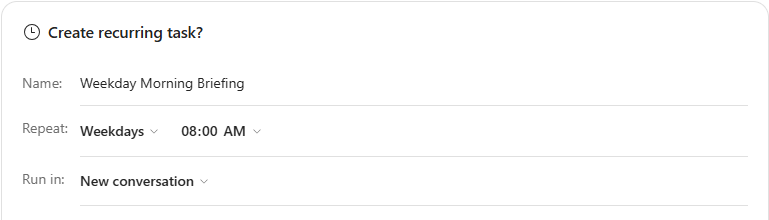
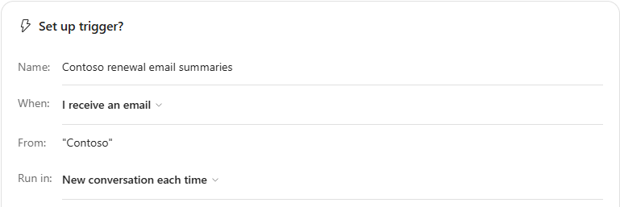
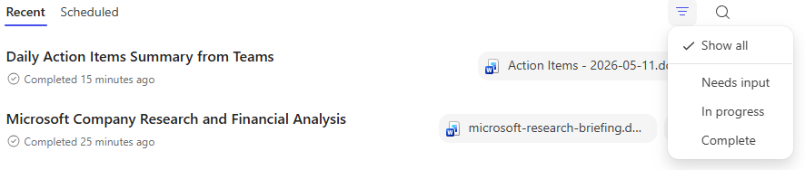

# Cowork Schedule Research Demo

**Scenario:**

You want a daily closing-bell brief on how Microsoft stock performed against its Magnificent Seven peers, delivered to your inbox without you having to request it each day. You'll use Copilot Cowork to research prices and relevant news, compare performance, maintain an Excel tracker in OneDrive, and email you the brief. Cowork runs the task once during the demo, then runs it on a recurring schedule. This demo uses public information only.

## Demo Setup

There are no sample documents required for this demo.

> **NOTE:** The prompts in this demo are suggestions. You can adjust them for your audience.

> **PRESENTER NOTE:** Cowork tasks are available under **Recent** and **Scheduled** in the left navigation. If time is limited, run the task before the session and set up the schedule in advance. During the demo, submit the prompt live to show Cowork starting the task and creating the schedule, then switch to the completed conversation to review the finished output.

## Demo

### Copilot Cowork

1. Open [Microsoft Copilot](https://m365.cloud.microsoft/chat/).

1. Select **Cowork**.

    

1. Start a **New task**.

1. In the prompt field, enter the following prompt:

    **Sample Prompt:**

    ```text
    Every weekday at 4:30 p.m. Eastern, research how Microsoft stock performed against its Magnificent Seven peers and email me a concise closing-bell brief.

    Identify the companies and tickers in the Magnificent Seven without requiring me to list them. Use one share class per company consistently. Use public information only—no brokerage accounts or private work data.

    Before writing the brief, review:

    - Microsoft's closing price and daily percentage change
    - The equivalent results for the other Magnificent Seven companies
    - QQQ's daily performance as a broader Nasdaq-100 benchmark
    - Relevant company announcements, earnings news, and major technology or economic developments

    Use the latest completed trading session and compare prices from matching dates. Exclude after-hours prices from the daily comparison. Skip market holidays when there is no new session to report.

    Prepare an email with the following structure:

    Bottom line — How Microsoft performed, where it ranked among the seven, and whether it outperformed or underperformed the other six companies' equal-weight average and QQQ. Express performance gaps in percentage points.

    Market snapshot — A compact table showing each company and QQQ, their closing prices, and daily percentage changes. Include links to the price sources.

    What mattered — Up to three relevant developments with source links. Distinguish reported facts from possible explanations; do not assume a headline caused a price move. Label any after-the-close news separately.

    Tracking — Update a single Excel workbook in OneDrive with each session's results and a comparison chart. Reuse the workbook without duplicating dates, and include its link in the email.

    Keep the brief tight enough to skim in under one minute. Avoid investment recommendations, generic commentary, and padding. Flag missing or uncertain data rather than guessing.

    Run it once now using the latest completed session, then establish the recurring schedule. Show me the email for approval before sending it to my own address.
    ```

1. Submit the prompt.

1. Cowork presents a **Create recurring task?** card summarizing the schedule it set up.

    

    - **Name**: A name that identifies the schedule, for example "Weekday Closing-Bell Brief."
    - **Repeat**: Set to **Weekdays** at the time requested in the prompt.
    - **Run in**: Select **New conversation** or **Current conversation**.

1. Ensure **Run once now** is selected, then select **Schedule**. This starts the first run immediately using the latest completed trading session.

    > **NOTE:** Clearing **Run once now** skips the immediate run. The first run then happens at the next scheduled time.

1. As Cowork works, point out the progress log and the side panel:

    - The **skills** Cowork loads
    - The Excel workbook Cowork creates or updates in OneDrive
    - The references and sources Cowork uses

1. When Cowork presents the email draft, review it, then approve sending it to your own address.

    > **NOTE:** By default, Cowork asks for approval before sending an email. You can approve the single action, or grant a standing approval to send only to your own address.

1. Open [Outlook](https://outlook.office.com/) and confirm that the brief was received.

### Optional: Set Up an Event-Driven Trigger

Use this section if you want to show how Cowork runs a task in response to an event instead of on a schedule.

1. Start a **New task** in Cowork.

1. Describe an event-driven task in plain language. For example:

    ```text
    Whenever I receive an email about the Contoso renewal, summarize it and draft a reply for my review.
    ```

1. Cowork presents a **Set up trigger?** card. Review and adjust it before arming the task.

    

    - **When**: The event that starts the task, such as **I receive an email**, **A Teams channel message arrives**, or **A Teams chat message arrives**.
    - **From**: An optional filter that narrows which events count, such as a subject keyword or sender.
    - **Run in**: Whether each event starts a new conversation or continues the current one.

1. Select **Set up** to arm the task.

### Review Your Tasks

1. In the left navigation, select **Recent** to show completed and in-progress tasks, along with the files they produced.

    

1. Select **Scheduled** to show the recurring task you created and its next run time.

    

    > **NOTE:** From the **Scheduled** page you can edit a task, run it now, pause it, resume it, or delete it. You can have up to five scheduled tasks at a time.

## Key Takeaway

In one request, Copilot Cowork ran a multi-step research task—identifying the companies, comparing prices and benchmarks, updating an Excel tracker, and emailing a brief—then placed it on a recurring schedule. Cowork asks for approval before sending, and both scheduled and event-driven tasks are managed from the **Scheduled** page.
