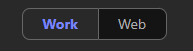

# HR Demo

**Scenario:**

You're an HR Manager at the Graphic Design Institute, and you've just kicked off the hiring process for a new Senior Animation Designer. You'll use Copilot to generate a tailored job description from the team's responsibilities document, compare incoming resumes against the role to shortlist the strongest candidates, and brief the hiring team on next steps over email.

## Demo Setup

The sample documents can be found in the MS-4021 GitHub repository [here](https://github.com/MicrosoftLearning/MS-4021-Copilot-Immersion-Experience/tree/master/ResourceFiles):

The specific files needed for this demo are:

- [Design_Team_Responsibilities.docx](https://github.com/MicrosoftLearning/MS-4021-Copilot-Immersion-Experience/raw/master/ResourceFiles/Graphic_Design_Institute_Design_Team_Responsibilities.docx)

- [Resume_Patti_Fernandez.docx](https://github.com/MicrosoftLearning/MS-4021-Copilot-Immersion-Experience/raw/master/ResourceFiles/Resume_Patti_Fernandez.docx)

- [Resume_Nestor_Wilke.docx](https://github.com/MicrosoftLearning/MS-4021-Copilot-Immersion-Experience/raw/master/ResourceFiles/Resume_Nestor_Wilke.docx)

- [Resume_Holly_Dickson.docx](https://github.com/MicrosoftLearning/MS-4021-Copilot-Immersion-Experience/raw/master/ResourceFiles/Resume_Holly_Dickson.docx)

- [Resume_Alex_Wilber.docx](https://github.com/MicrosoftLearning/MS-4021-Copilot-Immersion-Experience/raw/master/ResourceFiles/Resume_Alex_Wilber.docx)

> **NOTE:** Allow up to 10 minutes for these files to sync to your OneDrive after downloading. To avoid delays during the demo, ensure these files are downloaded and available in your OneDrive well in advance. If the files are not available, open the documents and copy the shared file links to use in the demo.

## Demos

### Copilot in Word

Let's start by asking Copilot in Word to generate a job description.

1. Open Word (either in your browser or desktop application).

1. In the **"Describe what you'd like to draft with Copilot"** prompt box, type the following:

    ```text
    I'm the HR Manager at the Graphic Design Institute. We've currently started the hiring process for a new Senior Animation Designer. Please review the attached document outlining the job responsibilities for this role and generate a detailed job description based on this information.

    [copy link or reference file to Design_Team_Responsibilities.docx]
    ```

    > **NOTE:** Attach the Design_Team_Responsibilities.docx file or paste the shared link directly into the prompt to ensure Copilot has access to the relevant content.

1. After reviewing and finalizing the job description, save the document as **GDI_Job_Description.docx** and copy the shared URL for use in the next step. (Enable AutoSave and select your OneDrive account if prompted.)

    

### Copilot Chat

Next, we'll use Copilot Chat to compare resumes we've received to the job description and identify the best candidates.

1. Open a browser and navigate to [M365copilot.com](https://m365copilot.com/).

1. Ensure Work Mode is selected.

    

1. In the prompt window, type the following:

    ```text
    We are hiring for the position of Senior Animation Designer. Please analyze the attached resumes and compare them to the requirements outlined in the job description provided here: [paste link to GDI_Job_Description.docx]. Rank the candidates from most qualified to least qualified, based on their alignment with the role.

    [Resume - Patti Fernandez
    Resume - Nestor Wilke
    Resume - Holly Dickson
    Resume - Alex Wilber]
    ```

    > **NOTE:** Attach the resumes or upload them to the prompt window. Alternatively, reference each file using the shared links or filenames in your OneDrive.

1. Optionally, you can ask Copilot Chat to export its response to a Word document to highlight this feature.

### Copilot in Outlook

Lastly, use Copilot in Outlook to draft an email to the hiring team regarding the top candidates.

1. Open Outlook (either in your browser or desktop application).

1. Select **New Email**.

1. Select the **Copilot** icon to the right of the ribbon.

1. Ensure **Edit with Copilot** is enabled.

    

1. Enter the following prompt:

    ```text
    Please draft an email to the hiring team to share that Nestor Wilke and Patti Fernandez align best with the Senior Animation Designer role based on their qualifications. Include a recommendation to schedule interviews for these candidates and request feedback on next steps.
    ```

## Key Takeaway

In a single demo, you moved an entire hiring stage forward — using **Copilot in Word** to generate a tailored job description, **Copilot Chat** to compare resumes against the role and rank candidates, and **Copilot in Outlook** to brief the hiring team. Tasks that normally span days of back-and-forth collapse into a focused, end-to-end workflow.
