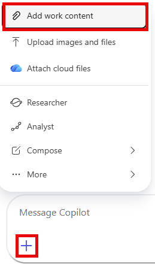
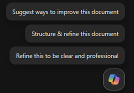
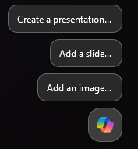

---
demo:
    title: 'Sales Demo'
---

[Back to Index](https://microsoftlearning.github.io/MS-4021-Copilot-Immersion-Experience/)

# Sales Demo

**Scenario:**

You're in sales at an EV charging company and you're shaping the strategic plan for next year. You'll use Copilot to research how the broader EV market is trending and contrast it with your own regional sales data, expand the resulting recommendations into a full implementation proposal in Word, and turn that proposal into a pitch-ready deck in PowerPoint.

## Demo Setup

The sample documents can be found in the MS-4021 GitHub repository [here](https://github.com/MicrosoftLearning/MS-4021-Copilot-Immersion-Experience/tree/master/ResourceFiles):

The specific files needed for this demo are:

- [Charger_sales_report_2022-2024.xlsx](https://github.com/MicrosoftLearning/MS-4021-Copilot-Immersion-Experience/raw/master/ResourceFiles/Charger_sales_report_2022-2024.xlsx)

> **NOTE:** Allow up to 10 minutes for these files to sync to your OneDrive after downloading. To avoid delays during the demo, ensure these files are downloaded and available in your OneDrive well in advance. If the files are not available, open the documents and copy the shared file links to use in the demo.

## Demos

### Copilot Chat

1. Open a browser and navigate to [M365copilot.com](https://m365copilot.com/).

1. Ensure **Web mode** is selected.

    

1. Let's start by asking Copilot to research a key metric. In the **Copilot Chat** prompt field, input:

    ```text
    What is the ratio of EV cars to EV chargers by region in the US for the past 3 years? Please show it in a table organized by region.
    ```

    

1. Now let's compare national trends to your company's sales performance. You'll upload the provided dataset and ask Copilot to visualize the data:

    In the prompt field, type:

    ```text
    I need to know the quarterly trends for each of our sales regions. Create a quarterly revenue line graph for the past 2 years based on: Charger_sales_report_2022-2024.xlsx
    ```

    > **NOTE:** Do not submit the prompt yet. Move to the next step to upload the file.

1. Select **Add and manage sources** > **Add work content** and search for [**Charger_sales_report_2022-2024.xlsx**](https://github.com/MicrosoftLearning/MS-4021-Copilot-Immersion-Experience/raw/master/ResourceFiles/Charger_sales_report_2022-2024.xlsx). Then submit the prompt.

    

    > **NOTE:** If the file is not available, you can select **Upload images and files** to upload the file directly.

1. Let's take it a step further by asking Copilot for recommendations exported to a Word document:

    In the prompt field, type:

    ```text
    Based on the trend, suggest two ways I can increase EV charger sales in the Mountain and Midwest regions. Export the recommendations to a Word Document.
    ```

1. Select the hyperlink Copilot provides for the new Word document to open it.

1. Once opened, select **Enable Editing** and then turn on **AutoSave**. Select your OneDrive account if prompted.

### Copilot in Word

We'll now ask Copilot to expand on these strategies and draft proposals on how to implement them.

1. The generated Word document from the previous demo should already be open, if not open it now (either in your browser or desktop application).

1. Select the **Copilot icon** that appears in the bottom right hand corner of the document.

    

1. Ensure **Allow editing** is selected.

    

1. In the prompt box, type the following:

    ```text
    Draft a detailed proposal on how we could implement each of the strategies outlined in this document. Ensure the plan is actionable and includes resource requirements, timelines, and key stakeholders.
    ```

    > **NOTE:** The drafted proposal will be added to the bottom of the existing document. Alternatively, if you go into **Chat Mode** (rather than **Edit Mode** the results will be shown in the Copilot pane instead of the Word document. You can then choose to insert the response into the document.

1. Select **Done** when satisfied with the output.

1. Once finished, save the document as **EV Sales Proposal.docx** and copy the shared URL to be used in the next step (enable AutoSave and select your OneDrive account).

    

### Copilot in PowerPoint

1. Launch Microsoft PowerPoint from your browser [PowerPoint.new](https://PowerPoint.new) or use the desktop application.

1. Open a new blank presentation.

1. Select the **Copilot icon** in the bottom right hand corner of the presentation.

    

1. In the Copilot pane, Type the following prompt:

    ```text
    Create a presentation from [Link to EV Sales Proposal.docx].
    ```

     > **NOTE:** Paste the shared link for the **EV Sales Proposal.docx** document.

1. Copilot begins generating slides based on the EV Sales Proposal, providing an outline along with features like speaker notes, images, slide layouts, and a General sensitivity label.

    > **NOTE:** Generating slides may take up to two minutes, depending on the document's complexity and number of slides.

## Key Takeaway

In a single demo, you turned a market signal into a sales-ready plan — using **Copilot Chat** to research EV adoption trends and visualize your own regional performance, **Edit with Copilot in Word** to expand the recommendations into a full implementation proposal, and **Copilot in PowerPoint** to generate a pitch-ready deck from that proposal. Strategy work that normally takes weeks of analysis and drafting compresses into a focused, end-to-end workflow.

[Back to Index](https://microsoftlearning.github.io/MS-4021-Copilot-Immersion-Experience/)
