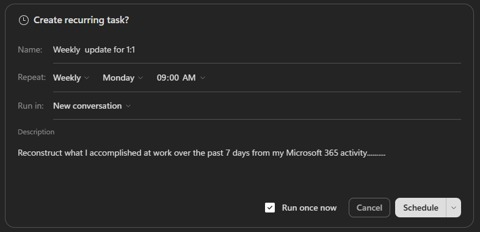

## Immersion Experience - Cowork

Put **Copilot Cowork** to work on something you redo all the time: the weekly "here's what I got done" update for your manager 1:1. You'll have Cowork reconstruct your week from your own Microsoft 365 activity, put it on a schedule so it runs without you, then teach it to write in your voice so the update comes back ready to send.

You'll perform three tasks:

- Reconstruct your week using **Copilot Cowork**
- Put the update on autopilot using **Copilot Cowork** (scheduled task)
- Make it sound like you by building a custom **skill** in **Copilot Cowork** (grounded in your work with WorkIQ)

> **NOTE:** Sample prompts are provided to help you get started. Feel free to personalize them to suit your needs—be creative and explore! If Copilot doesn't deliver the result you want, refine your prompt and try again. Enjoy the process and have fun experimenting!

> **NOTE:** Cowork adapts to the context it has, so it won't behave identically for everyone. Depending on what it already knows—or what permissions are already set up—it may or may not open an action window or ask a clarifying question before it runs. If your experience doesn't match the steps exactly, that's expected, not a mistake.

### Task 1: Reconstruct Your Week

Using **Copilot Cowork**, rebuild what you accomplished this week from your own Microsoft 365 activity—sent mail, completed tasks, meetings, and Teams threads—and turn it into a concise leadership update you can use in your next 1:1. This is your baseline draft.

**Steps**:

1. Open a new browser tab and navigate to [Microsoft 365 Copilot](https://m365.cloud.microsoft/chat/).

1. Select **Cowork**, then start a **New task**.

    

1. Give Cowork your work context. Select **+** > **Add work context** and point it at your recent activity: sent emails, completed tasks, meetings you led or attended, and an active Teams channel or two from the past week.

    > **TIP:** If you're not sure what to reference, just describe the window in your prompt (for example, "the last 7 days") and let Cowork search. Adding a few specific threads or tasks sharpens the result.

1. In the **Start a new task..** prompt field, enter the following prompt:

    **Sample Prompt**:
    
    ```text
    Reconstruct what I accomplished at work over the past week and email me a concise leadership update I can use in my next 1:1 or manager check-in.
    
    Before writing the update, review my Microsoft 365 activity from the last 7 days, including:
    
    - Sent emails and threads I actively drove
    - Teams chats and channel messages where I contributed meaningfully
    - Meetings I led, presented in, or where I owned follow-up
    - Files I created or edited, including Word, PowerPoint, Excel, Loop, and OneNote
    
    Focus on work that moved something forward. Ignore routine back-and-forth, FYI noise, status-only meetings, and recurring syncs unless they produced a decision, deliverable, or next step.
    
    Send me an email with the following structure:
    
    Accomplished - What shipped, progressed, or became clearer. Be specific. Tie each item to a real artifact, message, email thread, or meeting. Do not include anything you cannot point back to.
    
    Needs input - Open questions, blockers, decisions, or areas where I may want leadership input or help. If there is nothing substantive, write "n/a."
    
    Looking ahead - Work threads continuing or starting next week. Infer these from this week's activity and my upcoming calendar, but do not transcribe my calendar. Only name a specific meeting or session if it represents real work I'm driving. Skip routine or recurring syncs.
    
    Keep the update tight enough to skim in under one minute.
    
    If a section is thin, tell me what context I should add rather than padding it. If you are unsure whether something belongs, flag it as uncertain instead of guessing.
    ```

1. Submit the prompt. Cowork should come back with a draft email ready to send. Review the draft.

    

    For now, select **Cancel**. You'll schedule this same prompt in the next task.

      > **NOTE:** Choosing **Cancel** discards the draft—it isn't saved anywhere. If you asked Cowork to *draft* an email instead, it would save to your Outlook **Drafts** folder.

### Task 2: Put It on Autopilot

Using **Copilot Cowork**, automate the update so you never assemble it by hand again. You'll schedule the same prompt from Task 1 to run weekly and deliver the result to your own inbox.

**Steps**:

1. In the **same conversation** from Task 1, send a new prompt:

    **Sample Prompt**:

    ```text
    Schedule this to run weekly on Mondays at 8am
    ```

1. You'll be prompted to confirm the scheduled task details:

    

    - **Name**: Give the schedule a name that will help you recognize it later, for example "Weekly Manager Update."
    - **Repeat**: Ensure it's set to **Weekly** at 8am (or whatever time you prefer).
    - **Run in**: Select either **New conversation** or **Current conversation**. **New conversation** starts a fresh conversation each week; **Current conversation** continues the same thread each week.

1. Ensure **Run once now** is selected, then select **Schedule**.

1. Cowork goes through the same steps as before, but this time when it presents the draft, select **Always allow: Only to *your alias*@microsoft.com**.

    

Now every week Cowork assembles your update and sends it to your own inbox. You just skim it, tweak if needed, and forward it to your manager.

> **TIP:** Think about what other recurring write-up you could hand off to a schedule—a project status, a team digest, or meeting prep.

### Task 3 (Optional): Make It Sound Like You

The draft from Tasks 1 and 2 is accurate, but it probably still reads like an assistant wrote it. Using **Copilot Cowork**, build a custom **skill** that teaches Cowork to write in your voice—grounded in your real messages through WorkIQ—so your weekly update comes back ready to send.

A **skill** is a small set of saved instructions Cowork loads automatically whenever a certain kind of task comes up, so you teach it once and it applies every time. You won't write any code or edit any files—Cowork has a **guided skill builder** that interviews you and assembles the skill for you.

**Steps**:

1. Open [Microsoft 365 Copilot](https://m365.cloud.microsoft/chat/) and select **Cowork**.

1. In the navigation pane, select **Customize**, open the **Skills** tab, and select **Add**.

    

    > **TIP:** Or skip the menu and just tell Cowork what you want, starting with "I'd like to build a skill that ..."

1. From here, Cowork drives. It asks what the skill should do, then follows up on the details—tone, structure, what to always or never do. Answer in plain language, be specific, and keep going until the skill it drafts captures what you want. You can refine the name, description, and instructions anytime.

    

    Use the sample brief below to get started, then let Cowork ask its follow-up questions.

    **Sample Prompt**:

    ```text
    I'd like to build a skill that makes my drafts sound like me. When I ask for something "in my voice," "written like me," or "ready to send," pull 10-15 of my own recent messages of the same type from my Microsoft 365 activity (sent emails and Team messages) and match their cadence, length, structure, and tone—not a generic assistant style.
    
    The skill should:
    - Lead with the ask, decision, or main point, then add context only as needed.
    - Keep it tight—cut corporate filler, over-explaining, and unnecessary hedging.
    - Use bullets when there are multiple asks, options, or concerns.
    - Avoid generic assistant phrasing like "I hope this message finds you well" or "I wanted to reach out."
    - Never fabricate facts, names, numbers, dates, or commitments. If a draft needs information only I would know, ask me or flag the gap.
    ```

1. Once the skill is saved, start a **New task** in Cowork and ask it to do something that triggers your new skill—**without mentioning the skill by name**. For example, ask for your weekly manager update "written so it's ready to send."

1. Watch the side panel: your skill should load on its own. Compare the result to what you got in Task 1.

    > **NOTE:** Your skills live under **Customize** > **Skills**, and each one is saved as a `SKILL.md` file in your OneDrive (under `Documents/Cowork/skills/`). You can edit or remove it anytime, or ask Cowork to refine it.
