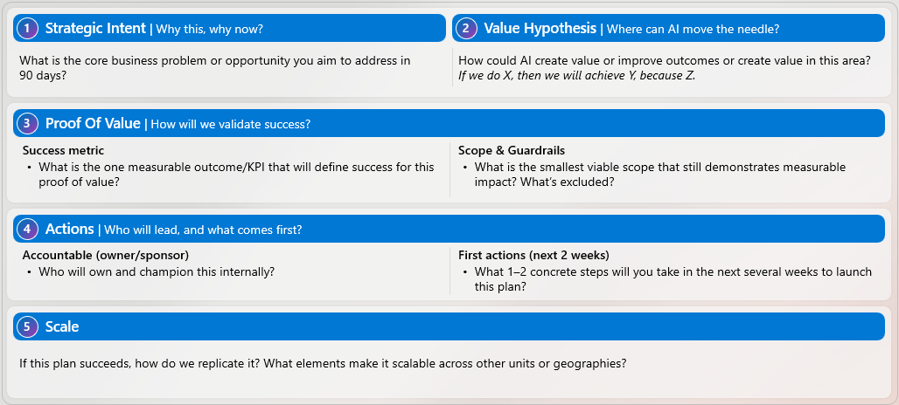
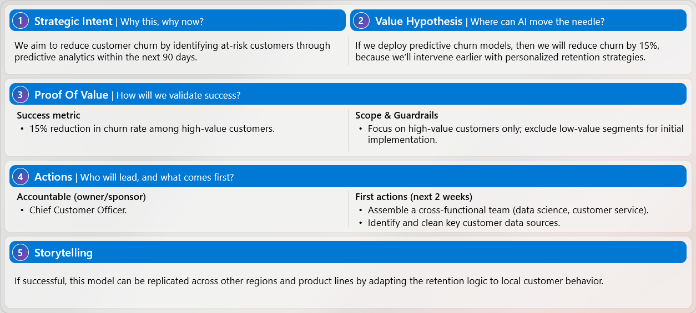

---
task:
  title: Immersion Experience - Design Your 90-day plan
---

# Design Your 90-day Plan

This next section shifts from defining direction to executing on it.

Now that you’ve defined your AI aspiration and prioritized a high-impact initiative, the next step is to turn that focus into action.

Design a focused, **90-day AI initiative** that delivers measurable business value and can scale if successful.

You’re not solving the full aspiration yet — you’re defining a focused entry point that moves it forward.

## Step 1: Outline Your Plan

Start by outlining your plan using the **template** below.  

Use it as a **thinking framework** — document your responses in Word, OneNote, Copilot Pages, or another tool of your choice.

Focus on **outcomes, impact, and measurability**, not tools or implementation details.



### 1. Strategic Intent — *Why this, why now?*

**Consider:**

- What business problem or opportunity are you addressing in the next 90 days?
- Why is now the right moment to act?

### 2. Value Hypothesis — *Where can AI move the needle?*

Describe how AI will create value using a simple cause-and-effect statement.

**Format:**

> *If we do X, then we will achieve Y, because Z.*

### 3. Proof of Value — *How will we validate success?*

**Success metric:**

- What is the **one measurable outcome or KPI** that defines success for your plan?

**Scope & guardrails:**

- What is the **smallest viable scope** that still demonstrates value?
- What is explicitly **out of scope**?

### 4. Actions — *Who will lead, and what comes first?*

**Accountable owner:**

- Who will own and champion the plan internally?

**First actions:**

- What **1–2 concrete steps** will you take to get this started?

### 5. Storytelling — *How does this scale?*

If this plan succeeds:

- How could it be replicated across teams, regions, or business units?
- What elements make it reusable or repeatable?

## Optional Reference: Sample 90-day Plan

If helpful, review the sample 90-day plan below as a reference for structure and level of detail.

Your 90-day plan should reflect your own priorities, constraints, and business context.



## Step 2: Review Your Draft with Copilot

Once you’ve drafted your plan, use Copilot to review and strengthen it.

**Sample Prompt:**

```text
Here is my draft of a 90-day plan for an AI initiative.

Please review it and suggest how I can make it more clear, compelling, and measurable for executive stakeholders. Focus your feedback on clarity, focus, and business impact.

Based on what you see, what would you recommend I improve or clarify, given what you know about my organization and priorities?
```

> **NOTE:**  
> To share your draft with Copilot, take a screenshot of your completed plan and paste it into Copilot:
> - **Windows:** Press **Windows + Shift + S** to capture your plan
> - **Mac:** Press **Command + Shift + 4** to capture your plan
> You can also paste your draft text directly into Copilot instead of uploading a screenshot.

## Step 3: Create a 1-Minute Executive Pitch

Use Copilot to help you turn your 90-day plan into a **concise, 1-minute pitch**.

**Sample Prompt:**

```text
Based on my updated 90-day plan, help me create a concise 1-minute pitch for my key stakeholder:
[describe your stakeholder, e.g., "Chief Operating Officer responsible for digital transformation"].

The pitch should clearly explain the business problem, the proposed approach, the expected impact, how success will be measured, and why this matters.

Please make the language clear, compelling, and suitable for an executive audience.

Here is my draft:
[paste your revised 90-day plan or summary here]
```
