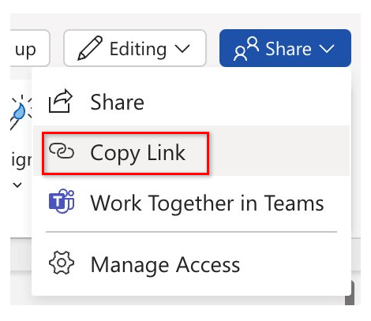
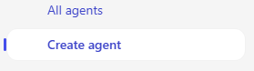
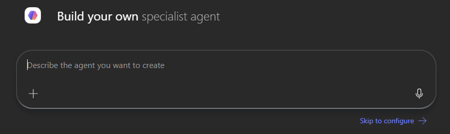
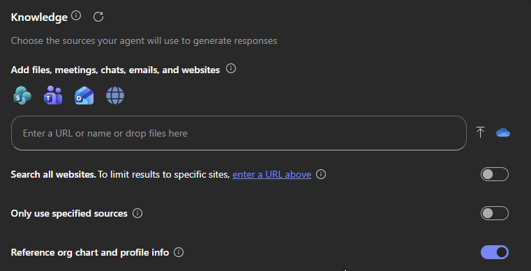
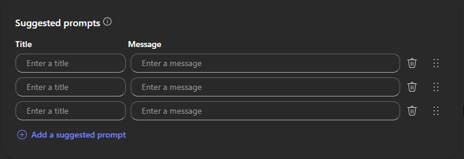

---
task:
    title: 'Immersion Experience – Idea to Agent'
---

## Immersion Experience – Idea to Agent

Experience how Microsoft 365 Copilot carries a single idea across apps—from a spark of
inspiration to a working agent. You'll brainstorm a company or product concept, shape it into
a document, turn that into a pitch deck, and finish by building a custom agent grounded in
your own work.

You'll perform four tasks:

- Brainstorm and research an idea in **Copilot Chat**
- Draft a concept document in **Copilot in Word**
- Generate a pitch deck in **Copilot in PowerPoint**
- Build a custom agent in **Copilot Studio**

Each task produces an artifact the next task builds on, so save your files to **OneDrive**
as you go.

> **NOTE:** Sample prompts are provided to get you started—personalize them to fit your idea.
> If Copilot doesn't nail the output first time, refine your prompt and try again.

### Task 1: Brainstorm & Research an Idea (Copilot Chat)

Use Copilot Chat to spark a company or product idea that fills a real market
gap, then research the competitive landscape.

**Steps:**

- Open a browser and navigate to [m365.cloud.microsoft/chat](https://m365.cloud.microsoft/chat).
- Sign in with your Microsoft work account and type in the following prompt:

    **Sample Prompt (brainstorm):**

    ```text
    Help me identify gaps in the [specific market or industry] that could be opportunities
    for a new product or company. Look for underserved areas or emerging trends to capitalize on.
    ```

    **Sample Prompt (research competitors):**

    ```text
    I'd like to explore the [industry or market segment] sector. Who are the key competitors?
    ```

- Copy both responses into a new Word document and save it to OneDrive as **Copilot Research.docx**.

> **IMPORTANT:** Save to OneDrive (not your local PC)—the next tasks need Copilot to access this file.

### Task 2: Draft a Concept Document (Copilot in Word)

Turn your research into a comprehensive concept—mission, vision, values, offerings, target
audience, and market edge.

**Steps:**

- Open **Copilot Research.docx**, select **Share → Copy Link**.

    

- Launch Word at [Word.new](https://Word.new), open a blank document, and select **Draft with Copilot**.

    

    **Sample Prompt:**

    ```text
    Draft a concept for our new [company or product] referencing [link to Copilot Research.docx],
    including its mission, vision, core values, offerings, target audience, and unique market edge.
    ```

- Select **Generate**, review the draft, then save to OneDrive as **Product Concept.docx**.

> **TIP:** Refine before saving—e.g., *"Make this more persuasive for potential sponsors"* or
> *"Improve the summary to make it more concise and impactful."*

### Task 3: Generate a Pitch Deck (Copilot in PowerPoint)

Transform your concept into a board-ready pitch deck that highlights value, market potential,
and competitive edge.

**Steps:**

- Open **Product Concept.docx** and select **Share → Copy Link**.
- Launch PowerPoint at [PowerPoint.new](https://PowerPoint.new) and open a blank presentation.
- In the Copilot pane, choose **Create presentation from file** and paste your link.

    **Sample Prompt:**

    ```text
    Create a presentation from [Link to Product Concept.docx].
    ```

- Review the generated slides and refine as needed.

> **TIP:** Enhance with prompts like *"Add 2 slides detailing potential challenges this product
> may face, plus a slide outlining strategies to mitigate them."*

### Task 4: Build a Custom Agent (Copilot Studio)

Bring it full circle by building an agent grounded in the files you just created.

**Steps:**

- **Start in Copilot Studio**

    1. Navigate to [m365.cloud.microsoft/chat](https://m365.cloud.microsoft/chat) and sign in.
    1. Select **Create an agent** in the right-hand rail to launch **Copilot Studio**.

        

- **Define your Agent (Describe tab)**

    ```text
    You're a virtual assistant for our [project/team name]. Your role is to help with
    [key tasks]. Be concise, stay on-brand, and reference our shared resources when possible.
    ```

    

- **Customize your Agent (Configure tab)**

    1. Add a knowledge source—use your **Copilot Research.docx** or **Product Concept.docx**
       from OneDrive/SharePoint.

        

    1. Define starter prompts to guide others in using your agent.

        

- **Test and Create**

    1. Use the **Test** pane to try your draft agent and refine any issues.
    1. Select **Create** to publish, then share it for immediate use.

> **IMPORTANT:** Add and configure knowledge sources before publishing if you want your agent
> to pull from specific content.

## Outcome of This Workshop

By the end of this session, you'll have moved one idea end-to-end through Copilot:

- A researched market opportunity
- A concept document
- A board-ready pitch deck
- A working, knowledge-grounded agent
